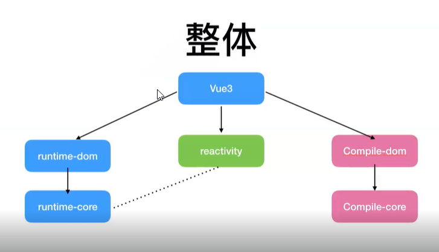
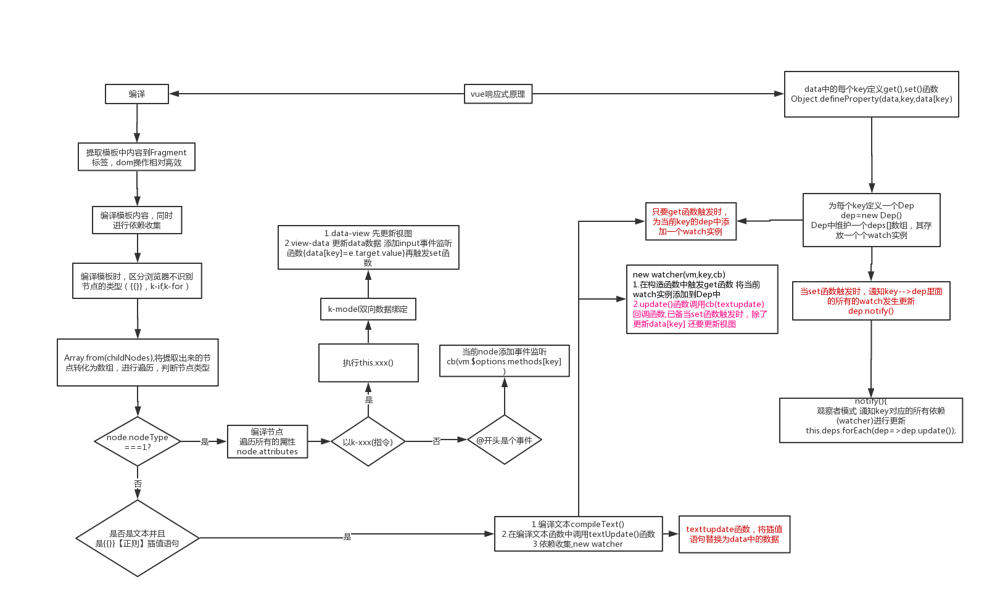
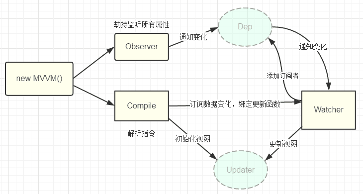

#### 源码

vue1.0 一个Dep---一个key---多个watcher,会导致页面中存在太多的watcher,内存，性能的消耗。

vue2.0 引入vnode,把watcher粒度变小，每个组件都只有一个watcher。。把所有的变化记录下来，将上一次的变化与这一次的变化进行对比，只有发生了变化的那些节点是需要watcher去更新的节点

初始化流程：

+ 将用户编译的模板编译为渲染函数，render函数(createElement)将传入的模板函数为vnode

  ```js
  入口 platforms/web/entry-runtime-with-compiler.js
  扩展默认$mount方法：处理template或el选项
  
  1. 先判断render函数存在不,若存在，则直接使用该render函数
  2. 若不存在，判断是否有模板，若有，拿到模板函数的innerHTML
                          若没有，判断是否有el, 若有拿到的OuterHTML
  3. 编译模板，生成render函数
   const {render,staticRenderFns} = compileToFunctions(template)
     compileToFunctions()    1:先将模板作为key,查看cache,若有，直接返回，没有开始compiler
                             2:将编译好的render对象，转换为function形式
     compiler编译 1：将parse将模板转为ast语法树,使用一系列的正则，解析模板中的指令v-for,v-if,v-else，class，style等数据
                  2：静态标记，patch时，diff算法直接跳过
                  3：generator根据ast生成code,render字符串中包含大量的_c,_l等处理vue中的特殊指令
  
  platforms/web/runtime/index.js
  定义$mount：挂载根组件到指定宿主元素
  定义__patch__：补丁函数，执行patching算法进行更新，将vnode转化为真实dom
  4. 挂载，mountComponent
      1: 执行beforeMount钩子 
      2：updateComponent = vm._update(vm._render())
         _render(vm.$createElement)_c将创建vnode 同一个render函数，生成不同的vnode
               _c:  isReservedTag(tag)原生标签
                    createComponet vue组件 函数组件
                       在注册全局api时，将component挂载到options中
                       installComponentHooks(data) 注册组件的钩子 存放至data.hook init中调动$mount
                       返回的虚拟vnode `vue-component-${Ctor.cid}${name ? `-${name}` : ''}`
         _update函数，patch与之前的vnode节点比较，得出差异，将差异节点渲染到真实的DOM上。
                vm.__patch__是否是真实DOM，是： 第一次生成时，判断是否是组件，
                                                若是，createComponet,生成实例，调用data.hook，注册挂载组件
                                                若不是，createElment,cbs.create钩子挨个执行
                                         不是 && sameVnode(新老节点)tag key 相同 打补丁  
                                         patch({nodeOps,modules})//平台特有的属性，怎么去生成真实的节点，nodeOps中就是这些生成，插入，删除节点的相关操作
                                             1：静态节点直接跳过 
                                             2：属性更新，指向cbs.update = [updateAttrs,updateClass,updateDOMProps,updateDOMListeners,updateStyle]的钩子挨个执行
                                             3：比较oldCh !== ch 是updateChildren 四指针
                                                孩子一个存在，一个不存在，addVnodes，removeVnodes
                                                比较text文本
      3：创建组件watcher，将updateComponet传入。watcher函数执行时，调用beforeUpdate钩子，再执行updateComponet
  ```

+ 数据响应式 

  ```JS
  object.defineProperty
  observer返回一个observer对象实例__ob__，存放一个dep，主要用来通知更新维护整个对象，数组。
  根据传入的value值，决定如何做响应化的操作；
    obserArray() 拿到每一项，看是否是对象，再去数据响应
    walk 对象遍历其中的key
  对象拿到所有的key defineReactive(obj,key[i])
                 dep与key一一对应，每一个对象都有一个观察者observer与之对立
                 get:dep.depend()相互引用，dep保存watcher,watcher保存dep。
                     一个watcher只属于一个组件，一对多，
                     若是组件中还有组件,相同的key对应多个组件，所以1个dep中多个watcher
  ```

+ watcher异步更新队列

  ```js
      给queue排序，这样做可以保证：
      1.组件更新的顺序是从父组件到子组件的顺序，因为父组件总是比子组件先创建。
      2.一个组件的user watchers比render watcher先运行，因为user watchers往往比render watcher更早创建
      3.如果一个组件在父组件watcher运行期间被销毁，它的watcher执行将被跳过。
    
    queue.sort((a, b) => a.id - b.id)
  ```

#### 组件实例

```js
vue.component('xzx',{})
在vue注册全局api时，将配置参数转化为一个vue实例（vue构造函数，在extend中调用vm.__init()初始化）
 if (type === 'component' && isPlainObject(definition)) {
          definition.name = definition.name || id
          definition = this.options._base.extend(definition)
 }
全局注册该组件 （components选项中，子组件会继承父组件的属性，变相的将该组件变为全局） this.options[type + 's'][id] = definition

在render函数中，使用createElement(tag)创建vnode时，去判断当前组件的components中是否有这个tag标签，
若有，拿到它的构造函数，开始生成组件vnode
isDef(Ctor = resolveAsset(context.$options, 'components', tag)))
createComponent(Ctor, data, context, children, tag)
installComponentHooks(data)在data上注册组件一些的钩子 init(){通过构造函数，拿到组件实例，执行child.$mount()挂载组件}
const vnode = new VNode(//组件的虚拟节点
    `vue-component-${Ctor.cid}${name ? `-${name}` : ''}`,
    data, undefined, undefined, undefined, context,
    { Ctor, propsData, listeners, tag, children },
    asyncFactory
  )


在patch()函数中，在createComponent
let i = vnode.data
 if (isDef(i = i.hook) && isDef(i = i.init)) {
        i(vnode, false /* hydrating */)执行挂载
  }
 属性的更改
 invokeCreateHooks(vnode, insertedVnodeQueue)
```

#### 事件监听

+ 初始化阶

  + 原生事件监听 platforms/web/runtime/modules/events.js

  ​       整体流程：patch() => createElem() => invokeCreateHooks() => updateDOMListeners() =>          

  ​       target.addEventLisnteners('click')

  + 自定义事件监听：patch()=>createElm()=>createComponent()=>hook.init()=>createComponentInstanceForVnode()=>_init()=>initEvents()=>updateComponentListeners()=>this.$on()

    > 事件监听和派发者均是组件实例，自定义组件中一定伴随着原生事件的监听与处理

#### $attrs

+ 在子组件上通过 v-bind="$attrs"类似于属性展开运算符，将父组件给子组件传递的除了props的属性都展开到子组件上。
+ 在子组件添加 inheritAttrs:false 包裹子组件的根组件不会继承在$attrs上的属性值。

#### 弹窗类组件

弹窗这类组件的特点是他们在当前vue实例之外独立存在，通常挂载于body;他们是通过js动态创建的，不需要再任何组件中声明。

``````js
1.构造组件
在执行$mount(id)挂载时,$el是包含了当前容器id 所以不能直接挂载到body上，不然删除时会直接删除body元素。
const vm = new Vue({
    render(h){
       return h(component,{props})
    }
}).$mount();
document.body.appendChild(vm.$el)
const comp = vm.$children[0] //获取组件实例
comp.remove=()=>{
    //移除dom
    document.body.removeChuld(vm.$el)
    //销毁组件
    vm.$destroy();
}
2.extend() 直接获取组件的构造函数
const Ctor = Vue.extend(Componet)
const comp = new Ctor({propsData:props})
comp.$mount()
documnet.body.appendChild(comp.$el);

``````

#### .sync 与v-model区别

####  递归组件

+ 设置递归组件的name

+ 设置递归组件终止的条件 当children中没有内容时，结束

  ```html
  <template> <li> <item v-for="model in model.children">{{model.title}} :key="item.title"></item></li></template>
  ```

#### router任务解析

+ 解析routes选项，拿到路径对应的组件

+ 监控url变化 

  + historyApi不会向服务器发送真正的请求

+ hash 页面的某处标注          

+ 嵌套路由的解决

  在子组件中也使用了<router-view>,则使用depth变量，递归记录要前渲染的组件在哪一个层级，再从matched数组中拿出matched[depth]组件进行渲染。

#### vuex的单向数据流

全局的通用的数据抽象到vuex树中，在vue组件中使用只能用不能改，能改的只有vuex中的特定的方法。该数据还必须是响应式的

+  实现插件，挂载$store
+  Store类，解析参数配置，持有state,实现dispatch,commit,getters、
+  借助Vue实现响应式 

#### 装饰器

装饰器用于扩展类或者它的属性和方法。@xxx

在vue中，可以直接使用数据，不用声明data

也可以直接使用寄存器充当计算属性

验证服务端返回的数据格式

```js
export function getFeatures(){
    //属性申名为数据从服务端返回的数据必须是Feature类型的数组
    return axios.get<Feature[]>('/api/list')
}
```

##### @Component

```js
1.收集class中的属性（遍历原型上的方法），方法放到Methods,get放到computed中，普通方法放到methods,普通属性混入到data中。
2.利用extend方法，将options传入，构造Vue构造函数，并返回
```


##### @Prop 声明组件属性

```js
export default class Helloword extends Vue{
    // Prop()参数是为value提供属性选项
    // !称为明确赋值类型断言，是提供给ts的
    @Prop({type:String,required:true})
    private msg!:string
}
```

##### @Emit 事件监听函数

```js
@Emit()
// addFeature是传递的函数名，返回值是传递的参数
addFeature(){
    return feature
}
//在子组件中使用
@add-feature = "addFeature"的监听函数
//类似于以前组件的写法
this.$emit('addFeature',feature)的事件触发函数
```

##### @watch

```js
@watch('msg')//需要监听的数据属性
onMsgChange(val:string,oldValue:string){
    //dosomething
}
```

##### 装饰器原理

装饰器是工厂函数，将传入目标

类装饰器表达式会在运行时当做函数被调用，类的构造函数作为其唯一的参数   

ES6中的类

```js
class Cat{
    say(){
        //do something
    }
}
//实际对应es5的方法是,实在构造函数的原型方法上挂载函数
function Cat(){}
Object.defineProperty(Cat.prototype,'say',{
    value:function(){//do something}
    enumerable:false,
    configurable:false,
    writable:true
})
//作用于类的装饰器
function log(target){
      target.name = 'xzx'
      return target
}
@log
class Cat{...}
//实际等同于 target是类的构造函数
Cat = log(function Cat(...))

//作用于属性的装饰器
function readonly(target,name,descriptor){
    descriptor.writable = false
    return descriptor
}
class Cat{
          @readonly
          say(){}
 }
//实际等同于
let descriptor = {
    value:function(){},
    enumrable:false,
    configurable:true,
    writable:true
}
descriptor = readonly(Cat.prototype,'say',descriptor) || descriptor
Object.defineProperty(Cat.prototype,'say',descriptor)
```


#### SSR

+ 是在服务端生成的app实例，所以对应不同的请求（不同的用户），要生成不同的实例

  导出路由，vuex,vue都导出为函数。    

+ 服务端入口文件

  导出一个提供给服务端的函数，可以根据接受到url设置路由（router.push(当前url)），然后返回创建的Vue实例。

  等到路由更新（查找匹配的组件，若匹配不到，返回的路由兑现的match数组为【】）完成，执行onReady(cb)的回调方法--该方法会在组件异步任务都结束完成，包括Ajax请求，查找匹配到了的对应组件。

+ 客户端入口文件

  在路由准备就绪后，挂载vue实例 app.$mount('#app',true)强制hydration混入模式，激活客户端

+ 配置文件

  ```js
  //1.配置跨平台变量
  npm i cross-env -D
  build:client:"vue-cli-service build"
  client:"cross-env WEBPACK_TARGET=node vue-cli-service build --mode serve"
  build:'npm run build:server && npm run build:client'
  
  
  const VueSSRServerPlugin = require('vue-server-renderer/server-plugin')
  const VueSSRClientPlugin = require('vue-server-renderer/client-plugin')
  //外置，用于优化打包的速度和体积
  const nodeExternals = require('webpack-node-externals')
  const merge = require('lodash.merge')
  
  //根据环境变量决定入口文件和相应的配置项
  const TARGET_NODE = process.env.WEBPACK_TARGET ==='node'
  const target = TARGET_NODE ?"server":"client"
  
  module.exports = {
      css:{extract:false},
      outputDir:'./dist'+target
      configureWebpack:()=>({
          entry:`./src/entry-${target}.js`,
          devtool:'source-map',
          // target设置为node使webpack以Node适用的方式动态导入
          // 并且还会在编译Vue组件时告知`vue-loader`输出面向服务器代码
          target:TARGET_NODE?"node":"web",
          //是否模拟node全局变量 
          node:TARGET_NODE?'undefined':false,
          output:{
              // 模块的导出风格
              libraryTarget:TARGET_NODE?'commonjs2':undefined
          },
          //从依赖模块导入的 CSS 还应该由 webpack 处理
          externals:TARGET_NODE
          ?nodeExternals({whitelist:[/.css$/]})
          :underfined,
          
          //将服务器的整个输出构建为单个JSON文件的插件
          plugins:TARGET_NODE 
          ?new VueSSRServerPlugin()
          :new VueSSRClientPlugin()
      })
  }
  ```

+ 服务端生成的文件渲染到html中

  ```html
  约定在body中,加入服务端渲染的插槽
  <body>
     <!--vue-ssr-outlet--> 
  </body>
  ```

+ 数据预存取

  ```js
  // 在所有预取钩子(preFetch hook) resolve 后，
  // 我们的 store 现在已经填充入渲染应用程序所需的状态。
  // 当我们将状态附加到上下文，
  // 并且 `template` 选项用于 renderer 时，
  // 状态将自动序列化为 `window.__INITIAL_STATE__`，并注入 HTML。
  context.state = store.state
  
  //客户端挂载之前
  if (window.__INITIAL_STATE__) {
    store.replaceState(window.__INITIAL_STATE__)
  }
  ```

+ 混入，解决客户端每个组件有asyncData，单页面也需要执行该函数

  ```js
  //1.main.js 全局混入
  Vue.mixin({
    beforeMount () {
      const { asyncData } = this.$options
      if (asyncData) {
        // 将获取数据操作分配给 promise
        // 以便在组件中，我们可以在数据准备就绪后
        // 通过运行 `this.dataPromise.then(...)` 来执行其他任务
        this.dataPromise = asyncData({
          store: this.$store,
          route: this.$route
        })
      }
    }
  })
  ```

+ SSR缺点

  + 服务器负载大

  + 开发条件限制 一些库的不支持

  + 构建部署：node.js环境     

#### Vue3



+ runtime-dom 浏览器相关

+ compile-dom  

+ tree-shaking 如果不import，则打包可以将该部分的代码丢掉，减少打包体积

+ composition可以拆包，放在独立的文件下。

+ vue3快 proxy 取代Object.defineProperty 

  Object.defineProperty在初始化data时，递归遍历所有的key，添加响应式，对数组不拦截

  proxy则是在需要使用Reactive时，才将其转化为响应式的**(懒收集)**，拦截整个对象，可以拦截所有的操作，

    支持所有的数据格式

+ vnode 

  compiler层做标记 ，render层只查找变化的

   加入静态的block 使得静态标记更厉害

  编译的compiler(options)不同平台中有不同的配置项的参数

+ vnode优化

  1. 对于静态的标签，没有第四个参数，是在diff时直接跳过

  2. 对于动态的标签，传入第四个参数，10 /* CLASS, PROPS */, ["name"] 通过&运算得出哪些属性是动态的，并且根据最后一个参数，得出，在diff时，只去追踪哪些动态的属性(|授权每个属性都要有   将最终得到的结果与其中一个 &校验 )

  3. 对于函数来说 添加了缓存，对于绑定的一个匿名函数，每次更新组件时，函数每次都是不一样的，会导致函数每次的加绑解绑，子组件的重新渲染，而添加了缓存以后，不会每次都产生一个新的函数，则不会再重新渲染子组件

  4. block tree v-for v-if 等动态节点的内部，节点结构是固定的，也可能存在一部份(区块)静态节点，一部份动态节点。但是在vue2中，直接将整体视为不是静态的。

     每个区块只需要以一个Array追踪自身包含的动态节点，只需要遍历该数组

  5. 渲染构造器 基于更改对DOM的操作，从而能实不同平台的渲染

      nodeOPS DOM节点的增删改查

      patchProp DOM属性的更新的操作 

+ vite

  利用浏览器import,自动发起网络请求，后端再将请求拦截，将需要获取的资源，从本地读取，再将源码返回，没有build这一过程，webpack的全量引入，而这里是对于main.js，用到啥引入啥。

  1. 浏览器的import机制，必须要有./ / ../等路径结构，需要rewriteImport 处理 import Xx from 'xx' 

     重写为 import Xx from '@modules/xx'    去本地node_modules中查找安装的文件夹，浏览器的import语句拿到的是package.json中的module字段中的路径文件，将该路径下对应的文件读取 返回给前端则可

2. 处理单文件组件 import App from './App.vue',使用 @vue/compiler-sfc 解析单文件组件 抽取里面的template 以及script(vue组件的option)    @vue/compiler-dom 解析template拿到render函数(发起另一个请求app?type=template)       

#### vue工作机制

> 在new vue()之后，vue会调用进行初始化，初始化生命周期、事件、props、methods、data、computed及watche等
> 其中最重要的是Object.defineProperty设置setter及getter, 用来实现[响应式]以及[依赖收集]
> 初始化之后调用$mount挂载组件
> 通过编译compile()函数生成渲染函数 
> 编译三阶段
> 1.parse: 使用正则解析template中的vue指令(v-xxx)变量等等 形成抽象语法树AST
> 2.optimize: 标记一些静态节点，用作后面的性能优化，在diff的时候直接略过
> 3.generate: 把第一部分生成的AST转化成渲染函数render function

```js
  //返回的是虚拟Dom树
   render(h) {
     //attrs 原生属性
     return h('table', {
       attrs: {
         border: 1
       }
     }, [children])
   }
```

渲染函数
1.touch 依赖收集 data中的数据与视图中的哪些部分绑定 将来data中的数据变化就通知视图的相应的部分发生改变
2.render 生成Virtual DOM Tree ---> 打补丁包函数(patch) ---> 生成真实的DOM

#### 函数式组件

可以通过jsx，传入jsx组件，在vue2.0需要区分不同的属性，组件属性props,html属性attrs,Dom属性domProps,

事件onXxx 原生事件nativeOnXxx，插件是通过正则匹配的方式在编译阶段将书写在组件上的属性进行分类。

vue3.0中，不用再区分属性，并且指令也可以使用

```js
//渲染函数组件没有this，props slots等属性都在context上面，没有生命周期，不需要实例化，不能使用计算属性，watch属性
// 函数式组件的props可以不用显示声明，在没有props里面声明的属性都会别自动隐式解析为prop,而普通组件所有未声明的属性都会被解析为$attrs自动挂载到组件根元素(通过inheritAttrs属性禁止)
export default{
  functional:true,
    props:{
        avatar:{type:String}
    },
    render(h,context){
        const {props} = context
        if (props.avatar) {
        return </img>
       }
        return </img>
       }
}
```

#### TS

interface: 表示function object class      给函数添加属性只能使用interface 不能继承，实现联合类型的type

type:除了上述，还可以表示基础的类型 ，不具有合并

交叉：类似于合并属性，成为一个集合

exclude<T,U> 得到 在T中但不在U中的类型

extract<T,U> 提取出在T中也在U中的类型

Omit<T,X>忽略在T中的属性X

Partial<T>将T中的属性都变为可选

Required<T>将T中的所有属性都变为必选

Readonly<T>将T中的所有属性都变为只读

Record<K,T>将K中所有的属性类型都变为T

#### vue 定制renderer渲染器

升级到vue3.0  vue2.0 vue add vue-next命令进行升级

```js
createRenderer({...nodeOps,patchProp})

const nodeOps = {} 
```

# mvvmvue

## vue工作机制

> 在new vue()之后，vue会调用进行初始化，初始化生命周期、事件、props、methods、data、computed及watche等
> 其中最重要的是Object.defineProperty设置setter及getter, 用来实现[响应式]以及[依赖收集]
> 初始化之后调用$mount挂载组件
> 通过编译compile()函数生成渲染函数 
> 编译三阶段
> 1.parse: 使用正则解析template中的vue指令(v-xxx)变量等等 形成抽象语法树AST
> 2.optimize: 标记一些静态节点，用作后面的性能优化，在diff的时候直接略过
> 3.generate: 把第一部分生成的AST转化成渲染函数render function

``` js
   //返回的是虚拟Dom树
   render(h) {
     //attrs 原生属性
     return h('table', {
       attrs: {
         border: 1
       }
     }, [children])
   }
```

> 渲染函数
> 1.touch 依赖收集 data中的数据与视图中的哪些部分绑定 将来data中的数据变化就通知视图的相应的部分发生改变
> 2.render 生成Virtual DOM Tree ---> 打补丁包函数(patch) ---> 生成真实的DOM

## defineProperty

``` js
   //数据劫持 当读'xxx'时触发get函数 当设置'xxx'值触发set函数
   Object.defineProperty(obj, '属性名xxx', {
     get() {

     },
     set(newVal) {}
   })
```

